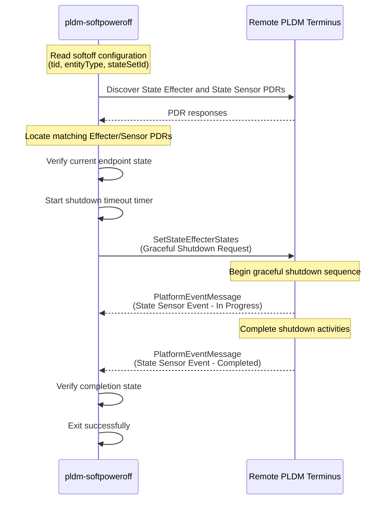

# PLDM Soft Power Off

## Overview

The `pldm-softpoweroff` application provides graceful host shutdown
functionality using the Platform Level Data Model (PLDM) protocol. It
coordinates with the remote pldm endpoint to perform a controlled shutdown by
sending PLDM Set State Effecter States commands and monitoring the shutdown
completion through state sensor events.

## Purpose

This application is responsible for:

- Monitoring the host's current state before initiating shutdown
- Initiating graceful shutdown or restart requests to remote PLDM terminus
  (typically the host)
- Waiting for shutdown completion confirmation via PLDM state sensor events
- Handling timeout scenarios if the host fails to respond or complete shutdown

## Configuration

### PLDM Model

The graceful shutdown flow is modelled using standard PLDM Platform Monitoring
and Control state effecters and state sensors.

A remote PLDM terminus is expected to:

1. Expose a State Effecter PDR that accepts a software termination request.
2. Expose a State Sensor PDR that reports software termination status.
3. Initiate a graceful shutdown when the effecter state is requested.
4. Generate state sensor events to indicate shutdown progress and completion.

The implementation uses the standard PLDM state set:

PLDM_STATE_SET_SW_TERMINATION_STATUS (129)

To support soft power off, the remote endpoint must expose matching State
Effecter and State Sensor PDRs for the software termination state set.

Example State Effecter PDR

- Terminus ID : 208
- Entity Type : 32801
- State Set : 129 (PLDM_STATE_SET_SW_TERMINATION_STATUS)

The effecter is used by OpenBMC to request a graceful shutdown through the PLDM
SetStateEffecterStates command.

Example State Sensor PDR

- Terminus ID : 208
- Entity Type : 32801
- State Set : 129 (PLDM_STATE_SET_SW_TERMINATION_STATUS)

The sensor is used by the remote endpoint to report software termination status
through PLDM state sensor events.

### Configuration File

Location: `configurations/softoff/softoff_config.json`

The configuration file defines the PLDM terminus and entity information for soft
power off:

```json
{
   "entries": [
+    {
+      "tid": 208,
+      "entityType": 32801,
+      "stateSetId": 129
+    },
+    {
+      "tid": 2,
+      "entityType": 45,
+      "stateSetId": 129
+    }
+  ]
}
```

**Parameters:**

- `tid`: PLDM Terminus ID of the remote endpoint
- `entityType`: PLDM entity type hosting the soft power off effecter
- `stateSetId`: State set ID for the software termination status (typically 129
  for `PLDM_STATE_SET_SW_TERMINATION_STATUS`)

The application tries each entry in order until it finds matching PDRs.

### Soft Power Off Flow

1. OpenBMC phosphor-state-manager starts the pldm-softpoweroff application.
2. The application reads the soft power off configuration.
3. The application searches for matching State Effecter and State Sensor PDRs
   using the configured terminus ID, entity type, and state set ID.
4. The application sends a PLDM SetStateEffecterStates request to the remote
   endpoint.
5. The remote endpoint receives the request and initiates a graceful shutdown.
6. During shutdown, the remote endpoint updates the software termination status
   sensor and generates PLDM state sensor events.

### Environment Variables

- `SOFTOFF_TIMEOUT_SECONDS`: Timeout duration for remote endpoint shutdown
  completion (default: implementation-defined)
- `SOFTOFF_CONFIG_JSON`: Path to the configuration directory (default: set at
  build time)



## Systemd Integration

### Service Unit

File: `services/pldmSoftPowerOff.service`

The service is configured as:

- **Type**: oneshot (runs once and exits)
- **Dependencies**:
  - Wants: `pldmd.service` (PLDM daemon must be available)
  - After: `pldmd.service` (starts after PLDM daemon)
  - Before: `obmc-host-stop-pre@0.target` (runs before host stop sequence)
  - Conflicts: `obmc-host-startmin@0.target` (prevents running during host
    start)

The service is typically triggered by the host shutdown sequence in OpenBMC.

## References

- [DMTF DSP0248: PLDM for Platform Monitoring and Control Specification](https://www.dmtf.org/sites/default/files/standards/documents/DSP0248_1.3.0.pdf)
- [DMTF DSP0249: PLDM State Set Specification](https://www.dmtf.org/sites/default/files/standards/documents/DSP0249_1.0.0.pdf)
